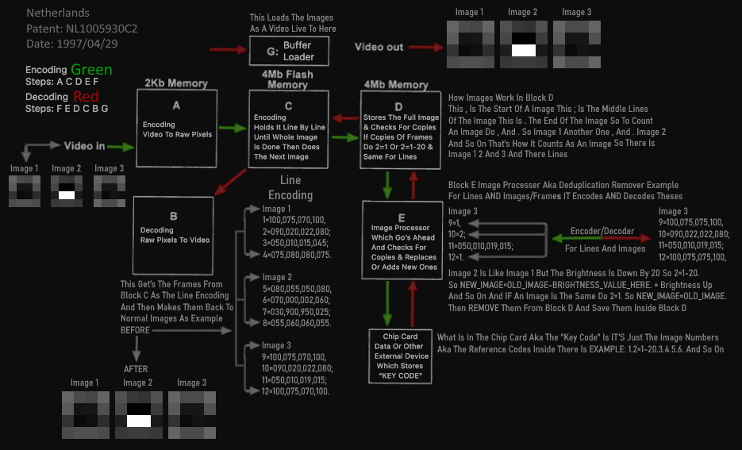

# NLE Encoding/Decoding
# NLE New Lossless Encoding (NLE)
<table>
  <tr>
    <td align="center">
      
       
      <b>NL1005930C2 (1995) - First Patent Diagram</b>
    </td>
    <td align="center">
      
       
      <b>NL1009908C2 (1999) – 2nd Patent Diagram</b>
    </td>
  </tr>
</table>
**NLE Encoding/Decoding** Is A Program I Have Developed Over The Past **2 Years** Of Hard Work EXACTLY REMAKING THE SDCS By Jan Sloot THIS IS The REMAKE OF THE SLOOT DIGITAL CODING SYSTEM IT'S SELF EXACTLY AS IT ACTED FROM THE 1995 TO 1999s 
This Is NOT COMPRESSION This Is Encoding There Are 2 Types Of Encoding
1: Encoding That Make Files Smaller Example H.256 For Videos
2: Encoding That Makes Data Into Another Form But Doesn't Compress The Size
(NLE) Is Option 2 MetaData And Key Code
It Can **make Any File Into A Smaller Size Using Encoded Output** This Works For:

- Images  
- Videos  
- Text  
- Audio  
- ZIPs  
- And More  

**Important:** To Decode Back To Normal You **must Have A Key Code And The Metadata** Without The Metadata Decoding Is **useless And Impossible**  

This Is A Project I Worked On After Trying Many Methods To Compress Or Encode Files To Smaller Sizes.
# I Have Tested Many Methods Over The Years It Was One Of The Hardest Projects I Have Done
---

- Seems Reversible But Finding The Exact Seed Impossible  
- Decoding Fast But Number Bigger Than Original Data.
# Methods I Tried That Failed And Why

<strong>Method 1 – Adding Up Numbers</strong>

Adding Up Numbers Doesn’t Work Example:  

- Hi = 34 + 9 = 43  
- IH Can Be 43 As Well  

Even With 2 Numbers It’s Impossible To Decode Back To Normal When Encoding/compressing You Will Have A Lot Of Data  

- Example: 4+3 = 7 5+2 = 7 1+6 = 7 → Multiple Results Impossible To Decode  
- Even Using Hashing Like 1+6 5+5 6+9 = 2372 → Hash Cannot Be Undone  

**Skipped**

<strong>Method 2 – Hashing Functions For Binary Code</strong>

- Impossible To Get Data Back  
- Brute Force Would Take Extremely Long  
- Metadata Doesn’t Help  

**Skipped**

<strong>Method 3 – Making Binary Code Shorter (64 Bits)</strong>

- Tried Shortening All 64-bit Sequences  
- 64 Bits = 3 Bytes Output Was 6–8 Bytes → Bigger Than Normal  

**Skipped**

<strong>Method 4 – Adding Binary Code Numbers To Decode Later</strong>

- Same Issue As Adding Numbers → Impossible  

**Skipped**

<strong>Method 5 – All Binary Codes Of 21 Bits In A Notepad</strong>

- Couldn’t Have Short Pointers Even When Updating Code  

**Skipped**

<strong>Method 6 – Procedural Generation</strong>

- Idea: Binary Code → Seed For Procedural Generation  
- Example:  

- 101010011111010101010101000100101011010101111000001010101010101010101010101011111111010010101 = 2378213123

- Seems Reversible But Finding The Exact Seed Impossible  
- Decoding Fast But Number Bigger Than Original Data  

**Skipped**

<strong>Method 7 – Hashing A File And Brute Force Recovery</strong>

- Impossible Due To Collisions Of Data  
- Data To Recover Would Be Huge  

**Skipped**

<strong>Method 8 – Shorter Pointers With Big Data</strong>

- Tried Encoding Zeros And Ones As AB BA BB AA  
- Cannot Encode All Sequences  

**Skipped**

<strong>Method 9 – Binary Code As One Character</strong>

- Example: 1 = A 0 = AA 10 = AAA  
- Output Would Be Massive (1 MB → 12 MB)  

**Skipped**

<strong>Method 10 – Delta Encoding Positions</strong>

- Example Positions: 1,32,31,23,12,315,43,64,5,234,234,478,5678,545,2,3265,4567,567,45  
- Delta Encoding → 1 -120 Etc → Output Bigger Or Same  

**Skipped**

<strong>Method 11 – Word Encoding</strong>

- Example: Hello → Hel = 12 Lo = 17  
- Encoding With Unicode Emojis A-Z A-z → Output Bigger  

**Skipped**

<strong>Method 12 – Compress Data Inside QR Code</strong>

- Tried Compressing Copies Of Same Data  

**Skipped**

<strong>Method 13 – Image With All Binary Code</strong>

- Output Bigger Than Normal  

**Skipped**

<strong>Method 14 – New Base Encoding</strong>

- Data Not Really Changed  

**Skipped**

<strong>Method 15 – Self-Updating Binary Code System</strong>

- Table Got Bigger System No Longer Worked  

**Skipped**

<strong>Method 16 – All Binary Code Inside 1 EXE</strong>

- Pointers Inside EXE → Impossible To Point To Bigger Data With Short Number  
- HEX Encoding → Same Problem  

**Skipped**

<strong>Method 17 – Adding Numbers To Compress</strong>

- Example: 234,639 + 344,621 = 579,260  
- Needed Sum + Middle + Last Numbers → Output Bigger  
- Before: 234639344621 = 12 Long  
- After: 5792604976 = 10 Long → Not Effective  

**Skipped**

<strong>Method 18 – Run Length Encoding</strong>

- Didn’t Save Space  

**Skipped**

<strong>Method 19 – Deduplication Using Positions</strong>

- Position Encoding Problem → Impossible  

**Skipped**

<strong>Method 20 – Checksum / Fingerprint / Hashing</strong>

- Cannot Reconstruct Original File  

**Skipped**

<strong>Method 21 – Character Count + Unique Hash</strong>

- Example: 0 = 523 1 = 1042 Hash = Ash45ru90sfdj08w34j53e48r09nfsdk843590  
- Cannot Decode  

**Skipped**

<strong>Method 22 – Adding Data Inside Images</strong>

- Compression Loses Data  

**Skipped**

<strong>Method 23 – Making Positions Into Small Numbers</strong>

- Example: Positions 1,5,8,11,14,17 → 1,2,2,2,1,2,1,2,2,2,1  
- Encoding → Sometimes Wrong Positions  

**Skipped**

<strong>Method 24 – Only Encoding Used Characters</strong>

- Metadata Required → Text Could Become Bigger  

**Skipped**

<strong>Method 26 – Binary Encoding 25 Bits Short Codes</strong>

- Saved Used Bits → Replaced With Short Codes  
- Output Bigger Metadata Needed  

**Skipped**

<strong>Method 26 – Crack File Using Few Bits</strong>

- Example 4-bit Sequences: 0000 0001 Etc  
- Output Bigger Decoding Impossible  

**Skipped**

<strong>Method 27 – 4096-Bit Encoding / Lookup</strong>

- Tried Encoding 4096 Bits → Metadata Required Lookup Table Huge  

**Skipped**

<strong>Method 28 – Encoding Binary Code To 94 Characters</strong>

- A-Z A-z 0-9 Symbols → Bytes Look Smaller But Total Size Bigger  

**Skipped**

<strong>Method 29 – Reencode 2 Bytes Per Chunk</strong>

- Needed Metadata → Took Lots Of Space  

**Skipped**

<strong>Method 30 – Word Encoding + Hash/Procedural Generation</strong>

- Words Saved + Hash/seed → Metadata Required  
- Typo Or Wrong Sequence → Decoding Impossible  

**Skipped**

<strong>Method 31 – EXE To Load Numbers/Binary Code</strong>

- Like KKrieg Or DirectX Procedural Generation  
- Did Not Reduce Size  

**Skipped**

<strong>Method 32 – EXEs With Binary Code For Decoding</strong>

- Too Many EXEs Too Many 25-bit Sequences → Bigger Output  

**Skipped**

<strong>Method 33 – Binary Encoding 25 Bits + Shorter Bits</strong>

- Saved Used Bits → Replaced With Shorter Bits  
- Metadata Required Decoding Impossible  
- Encoded File Looks Smaller But Cannot Decode Back  

**Skipped**

---

**Conclusion:**  

After 2 Years And Testing More Then **33 Methods+** Almost All Of My Approaches Have Failed Most Failed Due To:

- Metadata Requirements  
- Output Bigger Than The Original  
- Impossible Decoding  

**NLE Encoding/Decoding** Now Only Works With **Key Code + MetaData** To Recover Files Without Metadata Decoding Is **Useless And Impossible**.
